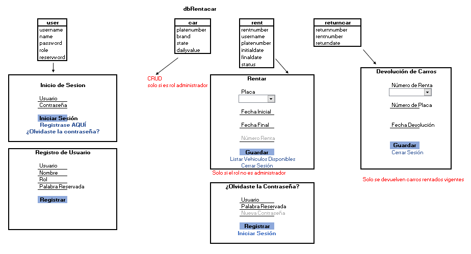

# Actividad
Crear un sitio web que contenga los siguientes arreglos de objetos, teniendo en cuenta el siguiente esquema y UIs:

### Tenga en cuenta que:

- El sitio tendrá una barra de navegación teniendo en cuenta las UIs expuestas.
- Los campos rentnumber (rent) y returnumber (returncar) son autonuméricos.
- La fecha inicial de la renta no puede ser inferior a la fecha del sistema.
- La fecha final de la renta debe ser igual o superior a la fecha inicial.
- Cada formulario debe tener las validaciones que considere necesarias según la información que se solicite.
- El usuario administrador solo tiene acceso al CRUD de carros y Devolución de carros
